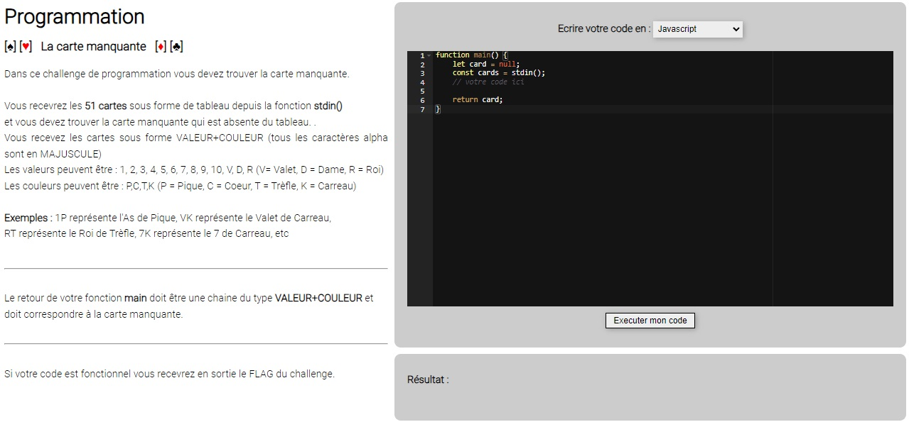

# CTF Programmation - La carte manquante

## Présentation du CTF 
**ID** 12 dans **les CTFs de Cyrhades**

Créez un algorithme qui vous retournera la valeur correspondante à la carte manquante.

## Aperçu

-----------

## Installation manuel
Vous n'utilisez pas l'application **les CTFs de Cyrhades** ? C'est dommage !
Mais voici comment installer ce CTF manuellement :

> git clone https://github.com/Hack-Oeil/LA_CARTE_MANQUANTE.git

> cd LA_CARTE_MANQUANTE && docker compose up

